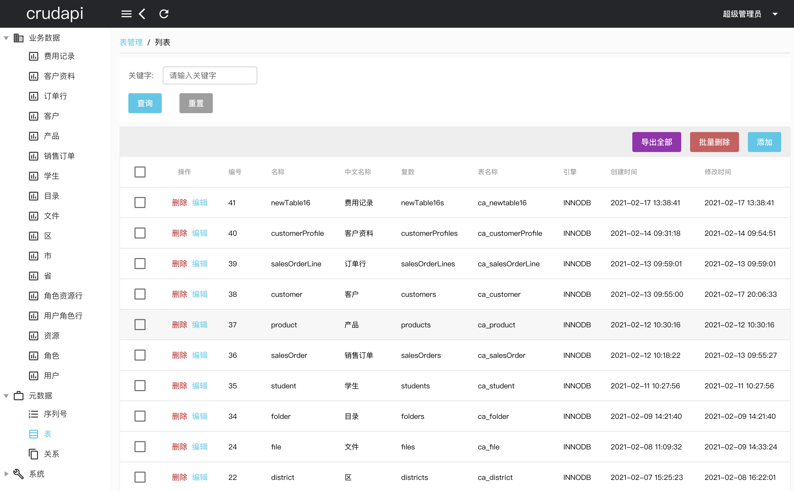

### crudapi👋
crudapi is a combination of crud and api, which stands for create, delete, update and retrieve interface. It is a zero-code product by configuring. crudapi allows you to focus on your business, save a lot of money, and improve your work efficiency by eliminating the tedious process of crud code. crudapi aims to make working with data easier and is free for everyone! 

### 增删改查接口👋
crudapi是crud+api组合，表示增删改查接口，是一款零代码可配置的产品。使用crudapi可以告别枯燥无味的增删改查代码，让您更加专注业务，节约大量成本，从而提高工作效率。crudapi的目标是让处理数据变得更简单，所有人都可以免费使用！

## GIT地址
名称 | 类型 | 授权 | GitHub仓库 | Gitee仓库
--- | --- | --- | --- | ---
crudapi-admin-web | Vue Qusar源码 | 开源 | [crudapi-admin-web](https://github.com/crudapi/crudapi-admin-web) | [crudapi-admin-web](https://gitee.com/crudapi/crudapi-admin-web)
crudapi (main)| Java源码(1.0稳定版) | 开源 | [crudapi](https://github.com/crudapi/crudapi) | [crudapi](https://gitee.com/crudapi/crudapi)
crudapi (ft-crudapi-2)| Java源码(2.0开发中) | 开源 | [crudapi](https://github.com/crudapi/crudapi/tree/ft-crudapi-2) | [crudapi](https://gitee.com/crudapi/crudapi/tree/ft-crudapi-2)
crudapi-example| Java集成SDK Demo | 开源 | [crudapi-example](https://github.com/crudapi/crudapi-example) | [crudapi-example](https://gitee.com/crudapi/crudapi-example)

### 文档
[https://help.crudapi.cn](https://help.crudapi.cn)

1. [基于Java和Spring Boot的后端零代码crudapi项目实战之环境搭建（一）](https://help.crudapi.cn/crudapi/helloworld.html)

持续更新中。。。

## 演示
演示地址：[https://demo.crudapi.cn/crudapi/](https://demo.crudapi.cn/crudapi/)


表单对应不同的对象


表关系图显示不同对象之间的关系


业务数据操作

### build
```bash
mvn clean install -Dmaven.test.skip=true

#aliyun mirror
mvn clean install -Dmaven.test.skip=true -s mirror-settings.xml
```

### downloadSources
```bash
mvn dependency:sources -DdownloadSources=true -DdownloadJavadocs=true

#aliyun mirror
mvn dependency:sources -DdownloadSources=true -DdownloadJavadocs=true -s mirror-settings.xml
```

### run
```bash
java -jar ./target/crudapi-0.0.4-SNAPSHOT.jar
```

### package
```bash
mvn clean package -Dmaven.test.skip=true
```

### GPG
```bash
gpg --gen-key

gpg --list-secret-key
gpg --list-key

gpg --delete-secret-keys
gpg --delete-keys

gpg --keyserver keyserver.ubuntu.com --send-keys KEY_ID
gpg --keyserver keyserver.ubuntu.com --recv-keys KEY_ID

gpg --list-signatures --keyid-format 0xshort

gpg --armor --export-secret-keys KEY_ID
gpg --armor --export KEY_ID
```

### deploy
```bash
export MAVEN_USERNAME=
export MAVEN_CENTRAL_TOKEN=
export MAVEN_GPG_PASSPHRASE=
mvn clean deploy -Dmaven.test.skip=true -s deploy-settings.xml
```

## 联系方式
#### 邮箱
admin@crudapi.cn

#### QQ
1440737304

#### QQ群
632034576

#### 微信
undefinedneqnull

<div align="left">
  
</div>

如有任何问题，欢迎咨询和交流！

## 授权

Copyright (c) 2021-present crudapi

[MIT License](https://baike.baidu.com/item/MIT许可证)

